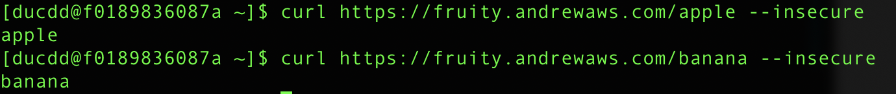

# AWS Application Load Balancer - ALB Ingress Controller - NGINX ingress controller

## Intro

This solution provides path based routing from ALB to different applications in the same EKS cluster.


ref. [Medium post](ttps://medium.com/@sajid2045/aws-eks-ingress-option-alb-nginx-fc64a4a5ea9f)

## Steps

1. Prerequisites
   * An EKS cluster with a nodegroup

1. Install ALB Ingress Controller
   * Follow <https://docs.aws.amazon.com/eks/latest/userguide/alb-ingress.html>

1. Install ALB Ingress
   * Generate a private key using OpenSSL:

   ```bash
   openssl genrsa 2048 > kube-fruity-private.key
   ```

   * Create a certificate using the key generated in step 1:

   ```bash
   openssl req -new -x509 -nodes -sha1 -days 3650 -extensions v3_ca -key kube-fruity-private.key > kube-fruity-public.crt
   ```

   The output should look similar to the following:

   ```bash
   Country Name (2 letter code) [XX]:
   State or Province Name (full name) []:
   Locality Name (eg, city) [Default City]:
   Organization Name (eg, company) [Default Company Ltd]:
   Organizational Unit Name (eg, section) []:
   Common Name (eg, your name or your servers hostname) []:fruity.andrewaws.com         ==>This is important
   Email Address []:
   ```

   * Upload the private key and the certificate to ACM in your AWS Region:

   ```bash
   aws acm import-certificate --certificate file://kube-fruity-public.crt --private-key file://kube-fruity-private.key --region us-west-2
   ```

   Note: Replace us-west-2 with your AWS Region.

   * Create ALB Ingress

   ```bash
   wget https://raw.githubusercontent.com/andrewaddo/aws-alb-nginx-ingress/master/templates/alb-ingress.yaml
   ```

   Edit the \<certificate-arn> with the above certificate's ARN

   ```bash
   kubectl apply -f alb-ingress.yaml
   ```

   Set up Route 53 to have your domain pointed to the ALB (optional):

   ```bash
   fruity.andrewaws.com.           A.
   ALIAS ALB_URL.elb.us-east-1.amazonaws.com
   ```

1. Install Kubernetes Nginx Ingress Controller

   ``` bash
   kubectl apply -f https://raw.githubusercontent.com/kubernetes/ingress-nginx/controller-0.32.0/deploy/static/provider/baremetal/deploy.yaml
   ```

   Review what have been installed
   * namespace/ingress-nginx created
   * serviceaccount/ingress-nginx created
   * configmap/ingress-nginx-controller created
   * clusterrole.rbac.authorization.k8s.io/ingress-nginx created
   * clusterrolebinding.rbac.authorization.k8s.io/ingress-nginx created
   * role.rbac.authorization.k8s.io/ingress-nginx created
   * rolebinding.rbac.authorization.k8s.io/ingress-nginx created
   * service/ingress-nginx-controller-admission created
   * service/ingress-nginx-controller created
   * deployment.apps/ingress-nginx-controller created
   * validatingwebhookconfiguration.admissionregistration.k8s.io/ingress-nginx-admission created
   * clusterrole.rbac.authorization.k8s.io/ingress-nginx-admission created
   * clusterrolebinding.rbac.authorization.k8s.io/ingress-nginx-admission created
   * job.batch/ingress-nginx-admission-create created
   * job.batch/ingress-nginx-admission-patch created
   * role.rbac.authorization.k8s.io/ingress-nginx-admission created
   * rolebinding.rbac.authorization.k8s.io/ingress-nginx-admission created
   * serviceaccount/ingress-nginx-admission created
  
1. Install Nginx ingress to backend apps

   ```bash
   https://raw.githubusercontent.com/andrewaddo/aws-alb-nginx-ingress/master/templates/fruity-ingress.yaml
   ```

   Edit \<host> value as applicable.

   ```bash
   kubectl apply -f fruity-ingress.yaml
   ```

1. Install the apps

   ```bash
   kubectl apply -f https://raw.githubusercontent.com/andrewaddo/aws-alb-nginx-ingress/master/templates/apps/apple.yaml
   kubectl apply -f https://raw.githubusercontent.com/andrewaddo/aws-alb-nginx-ingress/master/templates/apps/banana.yaml
   ```

1. Verification

   ```bash
   curl https://fruity.andrewaws.com/apple --insecure
   curl https://fruity.andrewaws.com/banana --insecure
   ```

   --insecure is required for self-signed certificate.

The result should be as 

## Features

1. De-couple ingress with Cloud
1. Allows adopting different ELBs (CLB/NLB/ALB)

## Other options

(as of 2020 Jun 2)

1. ALB + ALB ingress controller
   * ALB ingress controller does not support URL rewrite
   * One ALB is required per ingress rule
1. NLB + NGINX ingress controller
   * NLB (for EKS) does not support TLS termination. ELB and ALB do!
   * Benefits of using NLB vs. ALB
     * Static IP/elastic IP addresses
     * Scalability
     * Source/remote address preservation

## refs

1. <https://aws.amazon.com/premiumsupport/knowledge-center/eks-kubernetes-dashboard-custom-path/>
1. <https://aws.amazon.com/blogs/opensource/network-load-balancer-nginx-ingress-controller-eks/>

## Notes

1. ALB ingress controller uses nodegroup's IAM role's permissions to invoke AWS API to create/configure ALB
1. Attaching CM's certificate to ALB only work for certificate in the same region

## FAQs

1. Why do you choose to install nginx-controller manually through templates?
This <https://raw.githubusercontent.com/kubernetes/ingress-nginx/controller-0.32.0/deploy/static/provider/aws/deploy.yaml> creates a NLB, which we don't want for this lab.

1. I came across this (<https://medium.com/@sajid2045/aws-eks-ingress-option-alb-nginx-fc64a4a5ea9f)> can I follow those instructions?
The templates are archived into helm which makes it hard for me to fully understand in details how components are tied up together. By breaking down the steps, it is also easier to modify the setup. For example, if I would like to switch to use NLB instead of ALB, I can switch by creating another nlb-ingress.

1. I came across this (<https://aws.amazon.com/premiumsupport/knowledge-center/eks-kubernetes-dashboard-custom-path/)> can I follow those instructions?
The content of this lab follows the mentioned article. However, the article has outdated instructions. For example, <https://raw.githubusercontent.com/kubernetes/ingress-nginx/master/deploy/static/mandatory.yaml> is no longer available. In addition, this lab uses simpler apps (banana and apple) instead of dashboard to demonstrate the path based routing clearer.

1. ALB vs NLB?
This article <https://medium.com/awesome-cloud/aws-difference-between-application-load-balancer-and-network-load-balancer-cb8b6cd296a4> explains the high-level differences. In short, ALB is content-aware routing, and more flexible, where NLB is more robust in handling spike/high traffic.

1. nginx-ingress vs. ingress-nginx
Yes, this got me too! There are actually 2 (or more) main nginx controller
   * kubernetes/ingress-nginx is managed by Kubernetes community
   * nginxinc/kubernetes-ingress is managed by NGINX Inc and community
More on this here <https://github.com/nginxinc/kubernetes-ingress/blob/master/docs/nginx-ingress-controllers.md>
The instruction from this lab can apply for both controllers. For ngixinc's controller, follow the installation steps with Manifests <https://docs.nginx.com/nginx-ingress-controller/installation/installation-with-manifests/>
